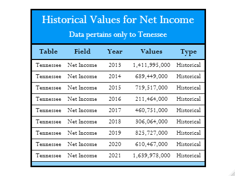

# Data Wrangling of Income and Wealth Statistical Data

The objective for this project is to extract data from an xlsx file with many tabs and generate a tidier data format for use.

## Tabular Examples of Extracted Data

### Entire Country

### State Level

#### Citation
>U.S. Department of Economic Research Service. Income and Wealth Statistics, December 1, 2022.
https://www.ers.usda.gov/data-products/farm-income-and-wealth-statistics/data-files-u-s-and-state-level-farm-income-and-wealth-statistics/
